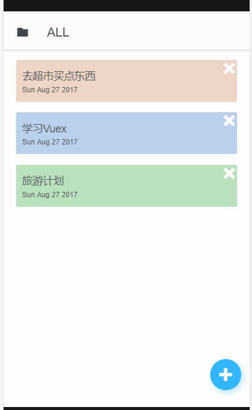
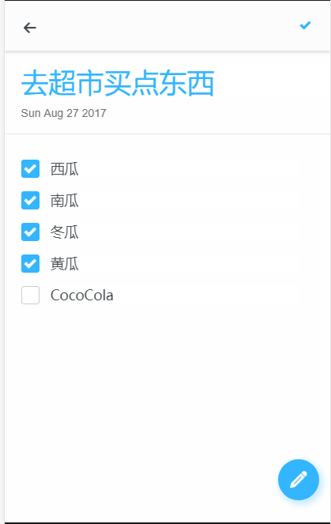

# 展示 #

为了更好的学习vue，所以找个一个todoList的渲染图，动手制作一个todoApp。因为渲染图是纯移动端的，所以我的布局逻辑优化都是纯移动端的。

话不多少，先上图！

# 技术栈 #

## 布局 ##

整个app都是利用了rem来进行一个布局的，在不同的移动设备上都拥有还算不错的显示效果。

所有图形都是字体图标，非常的小并且可以无损放大，非常好用

## Vue-router ##

vue-router我感觉非常适合这种切换的情况，比单组件切换的体验会更好一些，毕竟单纯组件做返回会非常麻烦，毕竟这是一个单页应用。单击返回的感觉真的很好。

## vuex ##

在我使用vue-router的时候出现一个棘手的问题，就是组件之间的通讯问题。在我这个应用之中，有着非常高频率的内部通讯。如果使用事件和props通讯，会出现非常大量的通讯路线，整个程序的复杂度会大大提高。

但vue的作者早就想到了这个问题。所以我使用vuex来管理整个数据模型。我仅仅使用了60行的vuex配置就完成了所有的数据管理，并且这些操作都是在一个文件之中，非常方便查看与分析！

## 开发总结 ##

我觉得在vue框架之下开发一个webapp是一件非常自然而又愉快的事情，感觉真的很棒。可以让我专注于数据的更新，专注业务本身的逻辑。并且性能非常之高，感谢虚拟DOM。感谢VUE。

另：默认配置下vue-cli build的路径是/ 所以可能会出现资源找不到的错误。

解决办法：修改项目config文件夹里index.js中的assetsPublicPath，默认是/，改成你想设置的子目录名称
比如在改成./就能在当前目录下去查找资源文件。

# 地址 #

Demo地址：[https://github.com/zhangzhengyi12/vue-todolist-app/tree/master](https://github.com/zhangzhengyi12/vue-todolist-app/tree/master)

预览地址：[http://www.laoliuscript.tk/vue-todolist-app/#/](http://www.laoliuscript.tk/vue-todolist-app/#/)

